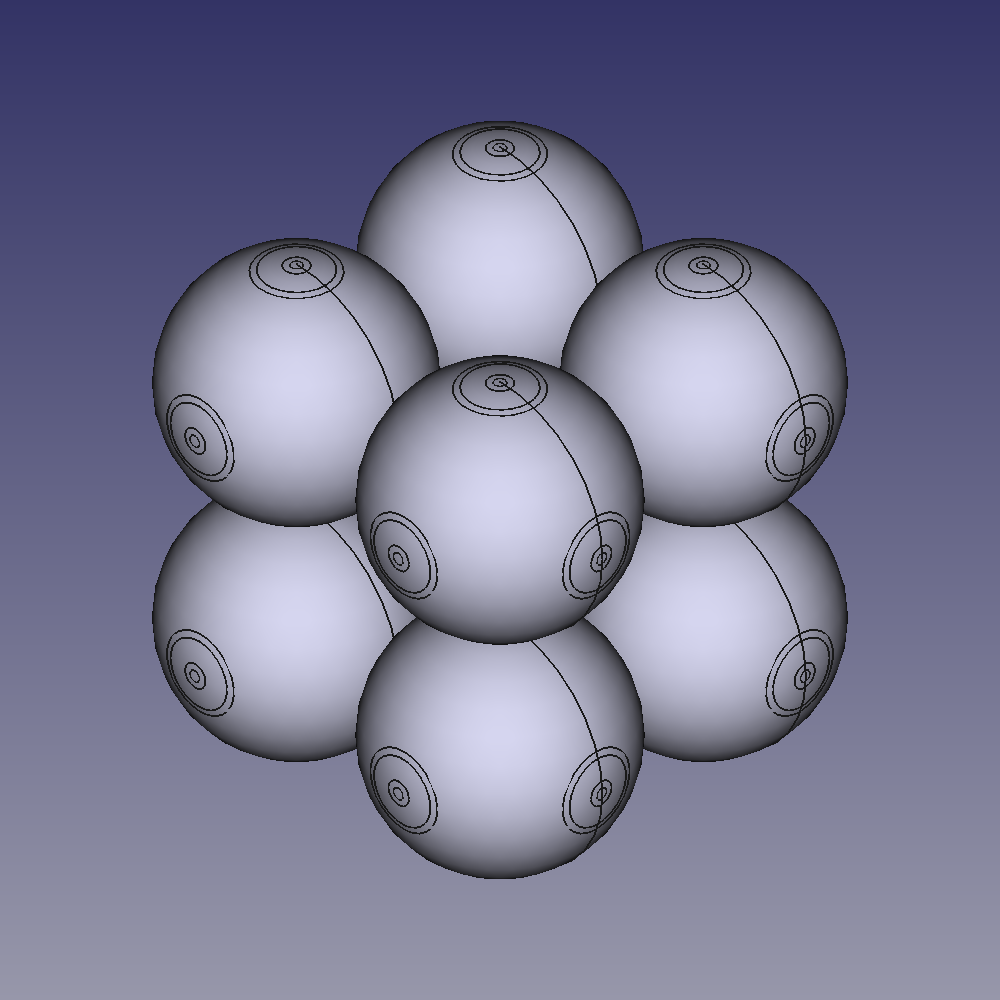
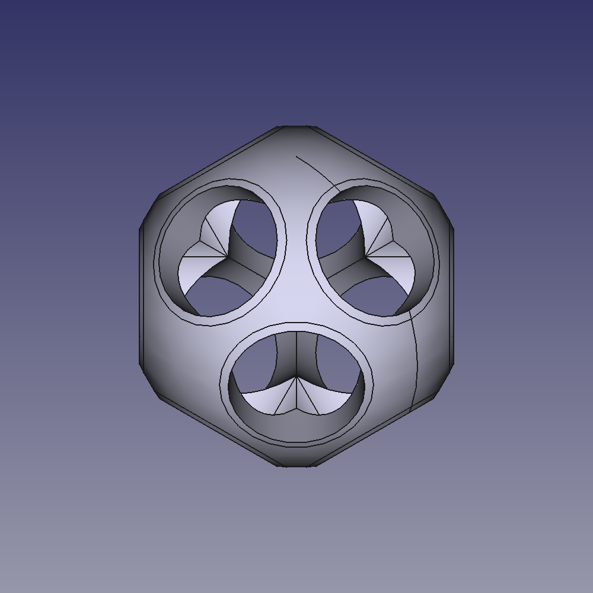

# SolidForms

A collection of FreeCAD Python scripts for constructing geometric figures. Each script generates a 3D model of a specific shape using parametric geometry, allowing for customization and export to STL for 3D printing.

<p float="left">
  
  
  
  
</p>

## Features

- **spherified_cube.py**: Generates a cube composed of overlapping hollow spheres, connected by cylinders.
  - Configurable sphere radius, cylinder radius, wall thickness, and cylinder shortening.
- **grid_cube.py**: Generates a grid cube structure made of rods, with spheres at each corner.
  - Customizable cube size and rod radius.
- **sphere1.py**: Represents a hollow sphere with eight cylindrical holes directed toward the vertices of a cube.
  - The cylinders are subtracted to create hollow channels running through the sphere, radiating from the center to the surface.
- **sphere2.py** Features a hollow sphere with twelve cylindrical holes arranged along diagonal planes. 
  - The holes are positioned symmetrically along the three axes, creating a network of channels cutting through the sphere. 
  - The holes pass through the sphere in directions such as (1,1,0), (1,0,1), and (0,1,1), connecting opposite sides.
- Exports directly to STL format for easy 3D printing.
- More shapes and scripts coming soon!

## Dependencies

- **FreeCAD 0.22** (or later)
- Python 3.x

## Getting Started

1. Clone the repository:
    ```bash
    git clone https://github.com/realsba/SolidForms.git
    ```
2. Open any .py script in FreeCAD's Python console or run it directly from the FreeCAD environment.
3. Modify parameters such as sphere radius, wall thickness, etc., inside the script to customize the model.
4. Export the generated model to STL for 3D printing.

## Example Usage
```bash
freecad-python3 spherified_cube.py
```
```bash
freecadcmd-python3 spherified_cube.py
```

This will create a 3x3x3 grid of hollow spheres connected by cylinders. The output is an STL file ready for 3D printing.

## Future Plans
- Add more scripts for different geometric forms.
- Improve the parameterization and customization options for the shapes.

## Contributing
Contributions are welcome! Feel free to open an issue or submit a pull request.

## License
This project is licensed under the MIT License - see the [LICENSE](https://github.com/realsba/SolidForms/blob/main/LICENSE) file for details.

## Author
- Bohdan Sadovyak

## Bugs/Issues
Please report any bugs or issues [here](https://github.com/realsba/SolidForms/issues).